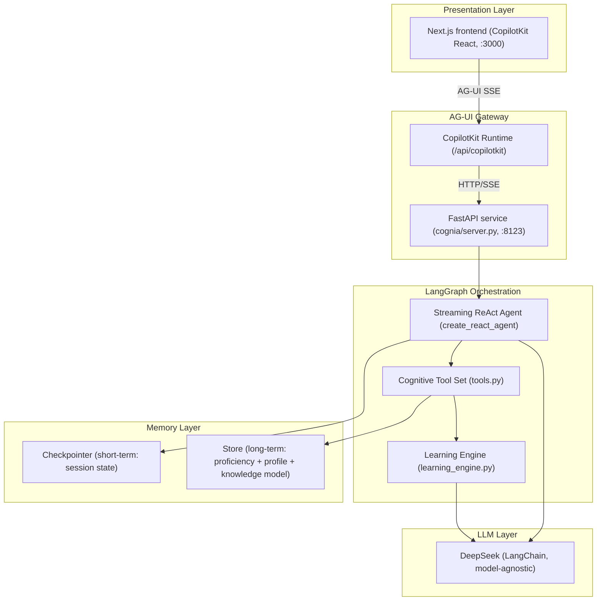

# Cognia

> **AI Proactive Learning Coach** — actively understands a learner's cognitive state, surfaces knowledge gaps and misconceptions, and dynamically guides them to true mastery.
> Not "users ask AI when they don't know", but "AI proactively finds what users don't know".

[](README.md)
[](README.zh.md)
[](https://www.python.org/)
[](https://langchain-ai.github.io/langgraph/)
[](https://nextjs.org/)
[](#license)
[](https://langfuse.com/)

> 🌏 This is the **English** documentation. For the **Chinese (简体中文)** version, see [README.zh.md](README.zh.md).

---

## Table of Contents

- [Cognia](#cognia)
  - [Table of Contents](#table-of-contents)
  - [What is Cognia](#what-is-cognia)
  - [Features](#features)
  - [Architecture](#architecture)
  - [Tech Stack](#tech-stack)
  - [Project Structure](#project-structure)
  - [Quick Start](#quick-start)
    - [Prerequisites](#prerequisites)
    - [1. Clone \& Install](#1-clone--install)
    - [2. Configure](#2-configure)
    - [3. Prepare the database](#3-prepare-the-database)
    - [4. Run](#4-run)
  - [Configuration](#configuration)
  - [Development](#development)
    - [Local Dev](#local-dev)
    - [Conventions](#conventions)
  - [How It Works](#how-it-works)
  - [API \& Endpoints](#api--endpoints)
    - [AG-UI endpoint (core)](#ag-ui-endpoint-core)
    - [Business routers (FastAPI)](#business-routers-fastapi)
  - [Observability](#observability)
  - [Testing](#testing)
  - [Documentation](#documentation)
  - [License](#license)

---

## What is Cognia

**Cognia** is a proactive AI learning coach built on LLMs and agent orchestration. Its core differentiator:

- Traditional learning tools: the user realizes they don't understand → asks → AI answers (reactive).
- **Cognia**: the AI *proactively* diagnoses the learner's cognitive state in conversation, detects **blinds spots (`unknown`)**, **misconceptions (`misconception`)**, and **partial mastery (`partial`)**, then *proactively* probes, explains, corrects, and backtracks until the learner builds genuinely transferable understanding.

**Target users (MVP)**: programmers learning a new framework / programming language.
**North-star metric**: of the cognitive gaps Cognia proactively diagnoses, ≥ 70% are admitted by the learner ("I didn't realize / misunderstood that"), and ≥ 50% match expert annotations.

**Keywords**: AI tutor, learning agent, cognitive diagnosis, knowledge graph, mastery tracking, BKT, LangGraph, ReAct agent, adaptive learning, 主动学习, 认知诊断, 知识模型, 学习教练, 智能辅导系统.

---

## Features

- **🧠 Proactive Cognitive Diagnosis**
  Instead of relying on self-report, an independent diagnoser model judges one of five cognitive states from the learner's own words: `unassessed / unknown / partial / misconception / mastered`.
- **🗺️ Knowledge Model & Knowledge Map**
  Automatically builds a DAG of knowledge points (with prerequisites) for a learning goal, reuses it stably across sessions, and visualizes it as a Cognitive Atlas star map.
- **📈 BKT Mastery Fusion (Bayesian Knowledge Tracing)**
  The AI only submits **observation samples (Observations)**; authoritative mastery is computed by a BKT algorithm that fuses the full observation history, preventing the AI from bypassing and directly writing state.
- **💬 Streaming ReAct Agent**
  Built on LangGraph `create_react_agent`; the frontend streams the reasoning chain and tool cards via AG-UI (CopilotKit).
- **🌐 Web-grounded Explanation**
  The `explain` tool forces a web search of official docs before explaining, appends sources, and keeps technical facts accurate.
- **📝 Learning Notes (Wiki)**
  One-click summarization of a learning session into a wiki draft with traceable evidence.
- **🧩 Thread Management**
  Postgres Checkpointer persists sessions on the backend, so context survives refresh / restart.
- **🔭 Observability**
  Optional Langfuse tracing of every LLM and tool call (zero-intrusion; auto-disabled when unconfigured).
- **🔌 Model-agnostic**
  LangChain integration, DeepSeek by default, swappable to OpenAI / Anthropic / local models with zero code changes.

---

## Architecture

Cognia uses a four-layer architecture (Presentation → Gateway → Orchestration → Memory) with unidirectional data flow and side effects isolated inside tool nodes.



**Core Loop**: learner states a goal → build knowledge model → learner expresses understanding → AI diagnoses cognitive state → proactively probe / explain / correct / backtrack → continuous verification → true mastery.

---

## Tech Stack

| Layer | Technology | Notes |
|------|------|------|
| Language | Python 3.12+ | The de-facto standard for agent development |
| Orchestration | **LangGraph 1.x** | Streaming ReAct (`create_react_agent`) + Checkpointer persistence |
| LLM | **DeepSeek** (LangChain) | Model-agnostic; swappable to OpenAI / Anthropic / local |
| Web Framework | **FastAPI** + Uvicorn | Async AG-UI endpoint |
| Frontend | **Next.js 16** + React 19 + TypeScript | App Router |
| Agent UI | **CopilotKit** (AG-UI protocol) + Tailwind 4 | Streaming chat + tool cards + Generative UI |
| Database | **PostgreSQL** (Supabase-hosted) + pgvector | Shared by Checkpointer + Store |
| Embedding | **fastembed** + pgvector | Lightweight ONNX CPU inference, no torch dependency |
| Observability | **Langfuse** (open-source MIT) | Optional, zero-intrusion |
| Package Manager | `uv` (Python) / `pnpm` (frontend) | — |

---

## Project Structure

```text
cognia-langGraph/
├── cognia/                     # Backend Python package (LangGraph agent core)
│   ├── server.py              # FastAPI + LangGraphAGUIAgent entry (AG-UI endpoint /)
│   ├── tools.py               # Cognitive tool set (build_cognia_tools, 7 @tool)
│   ├── learning_engine.py     # Knowledge-model build + diagnosis
│   ├── proficiency_engine.py  # BKT mastery fusion algorithm
│   ├── memory.py              # Checkpointer / Store wrapper + observation recording
│   ├── models.py              # Model routing (planner / diagnoser / teacher)
│   ├── schemas.py             # Pydantic models (5 states / knowledge model / observation)
│   ├── prompts/               # prompts-as-code (teacher / explainer / probe)
│   ├── wiki.py / wiki_repo.py / wiki_summarize.py  # Wiki notes
│   ├── feedback.py            # Feedback collection
│   ├── threads.py             # Multi-session management
│   ├── observability.py       # Optional Langfuse integration
│   ├── infra/                 # search (SearXNG) / store internals
│   └── routers/               # FastAPI routers (feedback / knowledge_map / threads / wiki)
├── frontend/                  # Next.js 16 + CopilotKit frontend
├── tests/                     # Unit tests + golden-set regression (pytest)
├── scripts/                   # Start / eval / migration scripts
├── docs/                      # Product / plan / constitution / design docs
├── data/                      # Local data (golden sets / wiki / search_cache)
├── pyproject.toml             # Python deps (uv)
└── .env.example               # Env var sample
```

---

## Quick Start

### Prerequisites

- Python **≥ 3.12** and [`uv`](https://github.com/astral-sh/uv)
- Node.js **≥ 18** and [`pnpm`](https://pnpm.io/)
- A PostgreSQL instance (local or Supabase-hosted)

### 1. Clone & Install

```bash
git clone <your-repo-url> cognia-langGraph
cd cognia-langGraph

# Backend deps
uv sync

# Frontend deps
cd frontend && pnpm install && cd ..
```

### 2. Configure

```bash
cp .env.example .env
# Edit .env — at least set LLM_API_BASE / LLM_API_KEY and LANGGRAPH_DATABASE_URL
```

### 3. Prepare the database

```bash
# Use a local Postgres (see scripts/start-local-pg.sh for a throwaway instance)
createdb cognia   # or run scripts/start-local-pg.sh
```

### 4. Run

One-shot start of both services (backend :8123 in background, frontend :3000 in foreground):

```bash
bash scripts/start.sh            # start all
# bash scripts/start.sh agui     # AG-UI backend only
# bash scripts/start.sh frontend # Next.js frontend only
```

Or start them separately:

```bash
# Terminal 1: backend
uv run python -m cognia.server
# or: uvicorn cognia.server:app --host 0.0.0.0 --port 8123 --reload

# Terminal 2: frontend
cd frontend && pnpm dev
```

Open **http://localhost:3000** in your browser to start chatting.

> Health check: `curl http://127.0.0.1:8123/health`

---

## Configuration

All configuration is injected via environment variables (`.env`, **never hardcode secrets**). Key variables — see `.env.example`:

| Variable | Description |
|------|------|
| `LLM_API_BASE` | OpenAI-compatible API base (default local adapter `127.0.0.1:8090/v1`) |
| `LLM_API_KEY` | LLM auth key |
| `PLANNER_MODEL` / `DIAGNOSER_MODEL` / `TEACHER_MODEL` | Per-role model IDs (default `deepseek-v4-flash-external`) |
| `THINKING_ENABLED` / `THINKING_EFFORT` | DeepSeek V4 thinking-mode toggle and effort |
| `LANGGRAPH_DATABASE_URL` | Postgres connection string (shared by Checkpointer + Store) |
| `LANGFUSE_PUBLIC_KEY` / `LANGFUSE_SECRET_KEY` / `LANGFUSE_HOST` | Langfuse observability (**enabled only when all three are set**, otherwise zero-intrusion off) |

> **Model-agnostic**: switching LLMs only requires changing `LLM_API_BASE` / `LLM_API_KEY` / `*_MODEL` — no code changes.

---

## Development

### Local Dev

```bash
# Backend hot-reload (uvicorn --reload)
uv run python -m cognia.server

# Frontend dev
cd frontend && pnpm dev

# Eval script (golden-set diagnosis regression)
uv run python scripts/eval.py
```

### Conventions

- **Layered, non-negotiable**: Presentation / Orchestration / Memory / Model; side effects only in tool nodes.
- **Cognitive authority lives inside tools**: the AI may only `propose_diagnosis` to submit observations; authoritative state is computed by BKT, never bypassed.
- **Prompts-as-code**: strategic system prompts live in `cognia/prompts/`, never inline.
- **Chinese comments**, TypedDict + Pydantic annotations, single node ≤ 150 lines.
- Every new node / conditional edge must have a unit test; run eval before changing prompt / tool / graph.

See [`docs/constitution.md`](docs/constitution.md) (project constitution) and [`docs/plan.md`](docs/plan.md) (technical plan).

---

## How It Works

1. **Knowledge-model build**: `build_learning_goal(goal)` uses the planner model to produce a knowledge-point DAG (with prerequisites), freezes it to the Store, and keeps `point_id` stable across sessions.
2. **Probe & express**: `generate_probe` produces an open-ended question that nudges the learner to explain the idea in their own words.
3. **Cognitive diagnosis**: `propose_diagnosis(...)` calls the diagnoser model to judge the five states and submits an **observation sample (append-only)** to the Store.
4. **BKT fusion**: `query_proficiency(point_id)` returns the authoritative mastery computed by BKT over the full observation history (continuous probability + discrete five states + uncertainty).
5. **Adaptive intervention**: `explain` picks a guiding /颠覆 / from-scratch style by the learner's state and forces a web search of official docs.
6. **Notes**: `summarize_session_to_wiki` summarizes the session into a wiki draft with traceable evidence.

**Five Cognitive States**:

| State | Meaning |
|------|------|
| `unassessed` | Not yet assessed |
| `unknown` | Blind spot (no concept at all) |
| `partial` | Partially mastered |
| `misconception` | Misunderstanding (needs颠覆 rebuild) |
| `mastered` | Mastered |

---

## API & Endpoints

### AG-UI endpoint (core)

| Method | Path | Description |
|------|------|------|
| `POST` | `/` | LangGraphAGUIAgent endpoint (AG-UI SSE, consumed by CopilotKit) |
| `GET` | `/health` | Health check |

### Business routers (FastAPI)

| Router | Description |
|------|------|
| `/feedback` | Learning-feedback collection |
| `/knowledge_map` | Knowledge-map query (DAG + cognitive state) |
| `/threads` | Multi-session management (list / title / delete) |
| `/wiki` | Wiki article query & management |

> The frontend forwards to the backend `POST /` via `POST /api/copilotkit` (Next.js CopilotKit Runtime).

---

## Observability

Cognia integrates **Langfuse** (open-source, MIT) for LLM / tool-call tracing:

- **Zero-intrusion, off by default**: a `CallbackHandler` is built only when `LANGFUSE_PUBLIC_KEY` + `LANGFUSE_SECRET_KEY` + `LANGFUSE_HOST` are **all set** in `.env`; otherwise `LANGFUSE_HANDLER is None`, no callback is injected and no network request is made.
- Every LLM + tool-node span of the main agent is recorded automatically via LangChain callback propagation.
- See [`docs/observability-langfuse.md`](docs/observability-langfuse.md).

---

## Testing

```bash
# Run all unit tests + golden-set regression
uv run pytest

# Run a single test file
uv run pytest tests/test_tools.py
uv run pytest tests/test_proficiency_engine.py
```

Coverage: diagnosis logic, BKT proficiency engine, tool layer, memory layer, schemas, prompt iron-law regression, etc. Golden sets live in `data/golden/`, split into dev set and blind set (blind cases must not be used as few-shots in prompts, to avoid overfitting).

---

## Documentation

- [`docs/product-brief.md`](docs/product-brief.md) — product one-pager (positioning / users / core hypothesis / north-star)
- [`docs/constitution.md`](docs/constitution.md) — project constitution (non-negotiable rules)
- [`docs/plan.md`](docs/plan.md) — technical plan (architecture / tools / data model / model routing)
- [`docs/spec.md`](docs/spec.md) — requirements spec v2.0
- [`docs/state-machine.md`](docs/state-machine.md) — cognitive state machine
- [`docs/knowledge-map-design.md`](docs/knowledge-map-design.md) — knowledge map / Cognitive Atlas design
- [`docs/wiki-system-design.md`](docs/wiki-system-design.md) — wiki system design
- [`docs/observability-langfuse.md`](docs/observability-langfuse.md) — Langfuse observability integration
- [`docs/frontend-aesthetics-guide.md`](docs/frontend-aesthetics-guide.md) — frontend visual guide
- [`docs/persistence-and-profile.md`](docs/persistence-and-profile.md) — persistence & user profile

---

## License

This project is currently private / proprietary. Unauthorized copying, distribution, or modification is prohibited. See internal agreement for details.

---

<p align="center">
  <sub>Cognia · AI Proactive Learning Coach · LangGraph + Next.js + CopilotKit</sub>
</p>
