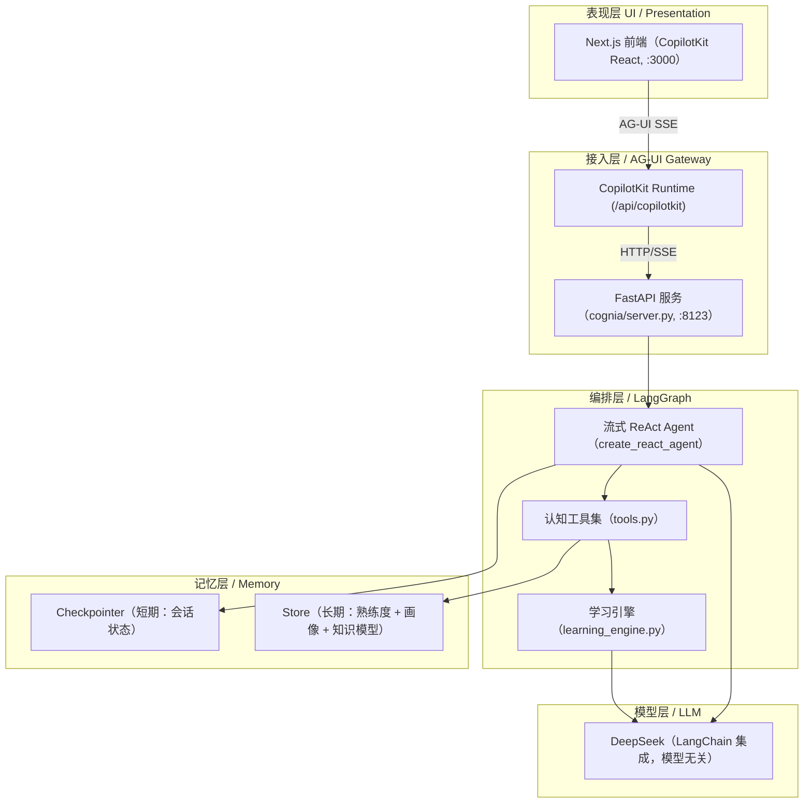

# Cognia

> **AI 主动学习教练 / AI Proactive Learning Coach** —— 主动理解用户的认知状态，发现知识盲区和错误理解，并动态引导用户真正掌握知识。
> Not "users ask AI when they don't know", but "AI proactively finds what users don't know".

[](README.md)
[](README.zh.md)
[](https://www.python.org/)
[](https://langchain-ai.github.io/langgraph/)
[](https://nextjs.org/)
[](#license)
[](https://langfuse.com/)

> 🌏 本文件为 **简体中文** 文档。英文版本请参阅 [README.md](README.md)。

---

## 目录 / Table of Contents

- [项目简介 / What is Cognia](#项目简介-what-is-cognia)
- [核心特性 / Features](#核心特性-features)
- [架构 / Architecture](#架构-architecture)
- [技术栈 / Tech Stack](#技术栈-tech-stack)
- [目录结构 / Project Structure](#目录结构-project-structure)
- [快速开始 / Quick Start](#快速开始-quick-start)
- [配置 / Configuration](#配置-configuration)
- [开发指南 / Development](#开发指南-development)
- [认知模型说明 / How It Works](#认知模型说明-how-it-works)
- [API 与端点 / API & Endpoints](#api-与端点-api--endpoints)
- [可观测性 / Observability](#可观测性-observability)
- [测试 / Testing](#测试-testing)
- [相关文档 / Documentation](#相关文档-documentation)
- [许可证 / License](#许可证-license)

---

## 项目简介 / What is Cognia

**Cognia** 是一个基于大语言模型（LLM）与 Agent 编排的 **主动式 AI 学习教练**。它的核心差异点在于：

- 传统学习工具：用户发现自己不懂 → 提问 → AI 回答（被动）。
- **Cognia**：AI 在对话中**主动诊断**用户的认知状态，发现「盲区（unknown）」「错误理解（misconception）」「部分掌握（partial）」，**主动追问、解释、纠错、回溯**，直到用户真正建立可迁移的认知。

**目标用户（MVP）**：程序员学习新框架 / 新编程语言。
**北极星指标**：AI 主动诊断出的认知缺陷中，≥ 70% 被用户本人承认「之前没意识到 / 理解错了」，且 ≥ 50% 与专家标注命中。

**Keywords / 关键词**：AI tutor, learning agent, cognitive diagnosis, knowledge graph, mastery tracking, BKT, LangGraph, ReAct agent, adaptive learning, 主动学习, 认知诊断, 知识模型, 学习教练, 智能辅导系统。

---

## 核心特性 / Features

- **🧠 主动认知诊断 / Proactive Cognitive Diagnosis**
  不靠用户自报，而是基于用户原话证据，用独立 diagnoser 模型判断五态认知状态：`unassessed / unknown / partial / misconception / mastered`。
- **🗺️ 知识模型与知识版图 / Knowledge Model & Knowledge Map**
  自动构建学习目标的知识点 DAG（含前置依赖），跨会话稳定复用，并可视化为 Cognitive Atlas 星图。
- **📈 BKT 熟练度融合 / Bayesian Knowledge Tracing**
  AI 只提交「观察样本（Observation）」，权威熟练度由 BKT 算法融合全部观察历史算出，防止 AI 旁路直写状态。
- **💬 流式 ReAct 对话 / Streaming ReAct Agent**
  基于 LangGraph `create_react_agent`，前端通过 AG-UI（CopilotKit）流式渲染思考链与工具卡片。
- **🌐 联网讲解 / Web-grounded Explanation**
  `explain` 工具强制检索官方文档后再讲解，附参考来源，保证技术事实准确。
- **📝 Wiki 沉淀 / Learning Notes**
  一键把学习会话总结为带溯源证据的 wiki 草稿文章。
- **🧩 多会话管理 / Thread Management**
  后端 Postgres Checkpointer 持久化会话，刷新 / 重启不丢上下文。
- **🔭 可观测 / Observability**
  可选接入 Langfuse 跟踪每一轮 LLM 与工具调用（零侵入，缺配置自动关闭）。
- **🔌 模型无关 / Model-agnostic**
  通过 LangChain 集成，默认 DeepSeek，可无痛切换 OpenAI / Anthropic / 本地模型。

---

## 架构 / Architecture

Cognia 采用四层分层架构（表现层 → 接入层 → 编排层 → 记忆层），单向数据流，副作用隔离在工具节点。



**核心闭环 / Core Loop**：用户提出学习目标 → 构建知识模型 → 用户表达理解 → AI 诊断认知状态 → 主动追问 / 解释 / 纠错 / 回溯 → 持续验证 → 用户真正掌握。

---

## 技术栈 / Tech Stack

| 层面 / Layer | 技术 / Technology | 说明 |
|------|------|------|
| 语言 / Language | Python 3.12+ | Agent 开发事实标准 |
| Agent 编排 / Orchestration | **LangGraph 1.x** | 流式 ReAct（`create_react_agent`）+ Checkpointer 持久化 |
| LLM | **DeepSeek**（LangChain 集成） | 模型无关，可切换 OpenAI / Anthropic / 本地 |
| 后端框架 / Web | **FastAPI** + Uvicorn | 异步 AG-UI 端点 |
| 前端 / Frontend | **Next.js 16** + React 19 + TypeScript | App Router |
| Agent UI | **CopilotKit**（AG-UI 协议）+ Tailwind 4 | 流式对话 + 工具卡片 + Generative UI |
| 数据库 / Database | **PostgreSQL**（Supabase 托管）+ pgvector | Checkpointer + Store 共用 |
| 向量检索 / Embedding | **fastembed** + pgvector | 轻量 ONNX CPU 推理，不依赖 torch |
| 可观测 / Observability | **Langfuse**（开源 MIT） | 可选，零侵入 |
| 包管理 / Package Mgr | `uv`（Python）/ `pnpm`（前端） | — |

---

## 目录结构 / Project Structure

```text
cognia-langGraph/
├── cognia/                     # 后端 Python 包（LangGraph Agent 核心）
│   ├── server.py              # FastAPI + LangGraphAGUIAgent 入口（AG-UI 端点 /）
│   ├── tools.py               # 认知工具集（build_cognia_tools，7 个 @tool）
│   ├── learning_engine.py     # 知识模型构建 + 诊断
│   ├── proficiency_engine.py  # BKT 熟练度融合算法
│   ├── memory.py              # Checkpointer / Store 封装 + 观察样本记录
│   ├── models.py              # 模型路由（planner / diagnoser / teacher）
│   ├── schemas.py             # Pydantic 数据模型（五态 / 知识模型 / 观察样本）
│   ├── prompts/               # prompts-as-code（teacher / explainer / probe）
│   ├── wiki.py / wiki_repo.py / wiki_summarize.py  # Wiki 沉淀
│   ├── feedback.py            # 反馈收集
│   ├── threads.py             # 多会话管理
│   ├── observability.py       # Langfuse 可选接入
│   ├── infra/                 # search（SearXNG）/ store 底层
│   └── routers/               # FastAPI 业务路由（feedback / knowledge_map / threads / wiki）
├── frontend/                  # Next.js 16 + CopilotKit 前端
├── tests/                     # 单元测试 + 金标集回归（pytest）
├── scripts/                   # 启动 / 评估 / 数据迁移脚本
├── docs/                      # 产品 / 技术方案 / 宪法 / 设计文档
├── data/                      # 本地数据（golden 金标集 / wiki / search_cache）
├── pyproject.toml             # Python 依赖（uv）
└── .env.example               # 环境变量样例
```

---

## 快速开始 / Quick Start

### 前置条件 / Prerequisites

- Python **≥ 3.12** 与 [`uv`](https://github.com/astral-sh/uv)
- Node.js **≥ 18** 与 [`pnpm`](https://pnpm.io/)
- 一个 PostgreSQL 实例（本地或 Supabase 托管）

### 1. 克隆与安装 / Install

```bash
git clone <your-repo-url> cognia-langGraph
cd cognia-langGraph

# 后端依赖
uv sync

# 前端依赖
cd frontend && pnpm install && cd ..
```

### 2. 配置环境变量 / Configure

```bash
cp .env.example .env
# 编辑 .env，至少填好 LLM_API_BASE / LLM_API_KEY 与 LANGGRAPH_DATABASE_URL
```

### 3. 准备数据库 / Database

```bash
# 使用本地 Postgres（参考 scripts/start-local-pg.sh 起一个临时实例）
createdb cognia   # 或执行 scripts/start-local-pg.sh
```

### 4. 启动服务 / Run

最简单：一键启动前后端（后端 :8123 后台，前端 :3000 前台）：

```bash
bash scripts/start.sh            # 启动全部
# bash scripts/start.sh agui     # 仅 AG-UI 后端
# bash scripts/start.sh frontend # 仅 Next.js 前端
```

或分开手动启动：

```bash
# 终端 1：后端
uv run python -m cognia.server
# 或 uvicorn cognia.server:app --host 0.0.0.0 --port 8123 --reload

# 终端 2：前端
cd frontend && pnpm dev
```

打开浏览器访问 **http://localhost:3000** 即可开始对话。

> 健康检查：`curl http://127.0.0.1:8123/health`

---

## 配置 / Configuration

所有配置通过环境变量注入（`.env`，**严禁硬编码密钥**）。关键变量见 `.env.example`：

| 变量 / Variable | 说明 |
|------|------|
| `LLM_API_BASE` | OpenAI 兼容 API 地址（默认本地 adapter `127.0.0.1:8090/v1`） |
| `LLM_API_KEY` | LLM 鉴权 key |
| `PLANNER_MODEL` / `DIAGNOSER_MODEL` / `TEACHER_MODEL` | 三角色模型 ID（默认 `deepseek-v4-flash-external`） |
| `THINKING_ENABLED` / `THINKING_EFFORT` | DeepSeek V4 思考模式开关与力度 |
| `LANGGRAPH_DATABASE_URL` | Postgres 连接串（Checkpointer + Store 共用） |
| `LANGFUSE_PUBLIC_KEY` / `LANGFUSE_SECRET_KEY` / `LANGFUSE_HOST` | Langfuse 可观测（**三变量齐全才启用**，否则零侵入关闭） |

> **模型无关**：更换 LLM 只需改 `LLM_API_BASE` / `LLM_API_KEY` / `*_MODEL`，代码零改动。

---

## 开发指南 / Development

### 本地开发 / Local Dev

```bash
# 后端热重载（uvicorn --reload）
uv run python -m cognia.server

# 前端开发
cd frontend && pnpm dev

# 评估脚本（金标集诊断回归）
uv run python scripts/eval.py
```

### 代码规范 / Conventions

- **分层不可谈判**：表现 / 编排 / 记忆 / 模型四层；副作用只在 tool 节点。
- **认知裁决权在工具内**：AI 只能 `propose_diagnosis` 提交观察样本，权威状态由 BKT 融合算出，不可旁路直写。
- **Prompts-as-code**：策略性 system prompt 统一抽到 `cognia/prompts/`，禁止内联。
- **注释中文**，类型注解用 TypedDict + Pydantic，单节点 ≤ 150 行。
- 每个新增节点 / 条件边必须带单元测试；变更 prompt / tool / graph 前先跑 eval 不回归。

详见 [`docs/constitution.md`](docs/constitution.md)（项目宪法）与 [`docs/plan.md`](docs/plan.md)（技术方案）。

---

## 认知模型说明 / How It Works

1. **知识模型构建**：`build_learning_goal(goal)` 用 planner 模型生成知识点 + 前置依赖 DAG，冻结到 Store，`point_id` 跨会话稳定。
2. **探针与表达**：`generate_probe` 生成开放式问题，引导用户用自己的话表达理解。
3. **认知诊断**：`propose_diagnosis(...)` 调用 diagnoser 模型判五态，提交**观察样本（只追加）**到 Store。
4. **BKT 融合**：`query_proficiency(point_id)` 返回系统用 BKT 融合全部观察历史后的权威熟练度（连续概率 + 离散五态 + 不确定性）。
5. **自适应干预**：`explain` 按用户状态选择引导式 / 颠覆式 / 从零建立讲解，并强制联网检索官方资料。
6. **沉淀**：`summarize_session_to_wiki` 把会话总结为带溯源的 wiki 草稿。

**认知状态五态 / Five Cognitive States**：

| 状态 | 含义 |
|------|------|
| `unassessed` | 未评估 |
| `unknown` | 盲区（完全没概念） |
| `partial` | 部分掌握 |
| `misconception` | 错误理解（需颠覆重建） |
| `mastered` | 已掌握 |

---

## API 与端点 / API & Endpoints

### AG-UI 端点（核心）

| 方法 | 路径 | 说明 |
|------|------|------|
| `POST` | `/` | LangGraphAGUIAgent 端点（AG-UI SSE，供 CopilotKit 消费） |
| `GET` | `/health` | 健康检查 |

### 业务路由（FastAPI Router）

| 路由 | 说明 |
|------|------|
| `/feedback` | 学习反馈收集 |
| `/knowledge_map` | 知识版图查询（DAG + 认知状态） |
| `/threads` | 多会话管理（列表 / 标题 / 删除） |
| `/wiki` | Wiki 文章查询与管理 |

> 前端通过 `POST /api/copilotkit`（Next.js CopilotKit Runtime）转发到后端 `POST /`。

---

## 可观测性 / Observability

Cognia 集成 **Langfuse**（开源，MIT）做 LLM / 工具调用追踪：

- **零侵入默认关闭**：仅当 `.env` 中 `LANGFUSE_PUBLIC_KEY` + `LANGFUSE_SECRET_KEY` + `LANGFUSE_HOST` **三变量齐全**时才构建 `CallbackHandler`；否则 `LANGFUSE_HANDLER is None`，不注入任何 callback、不发任何网络请求。
- 主 agent 每轮 LLM + 工具节点 span 由 LangChain 自动透传记录。
- 详见 [`docs/observability-langfuse.md`](docs/observability-langfuse.md)。

---

## 测试 / Testing

```bash
# 运行全部单元测试 + 金标集回归
uv run pytest

# 运行单个测试文件
uv run pytest tests/test_tools.py
uv run pytest tests/test_proficiency_engine.py
```

测试覆盖：诊断逻辑、BKT 熟练度引擎、工具层、记忆层、Schema、Prompt 铁律回归等。金标集位于 `data/golden/`，区分开发集与盲测集（盲测集禁止写入 prompt 当 few-shot，防过拟合）。

---

## 相关文档 / Documentation

- [`docs/product-brief.md`](docs/product-brief.md) — 产品一页纸（定位 / 用户 / 核心假设 / 北极星）
- [`docs/constitution.md`](docs/constitution.md) — 项目宪法（不可谈判的规则）
- [`docs/plan.md`](docs/plan.md) — 技术方案（架构 / 工具 / 数据模型 / 模型路由）
- [`docs/spec.md`](docs/spec.md) — 需求规格 v2.0
- [`docs/state-machine.md`](docs/state-machine.md) — 认知状态机
- [`docs/knowledge-map-design.md`](docs/knowledge-map-design.md) — 知识版图 / Cognitive Atlas 设计
- [`docs/wiki-system-design.md`](docs/wiki-system-design.md) — Wiki 沉淀系统设计
- [`docs/observability-langfuse.md`](docs/observability-langfuse.md) — Langfuse 可观测接入
- [`docs/frontend-aesthetics-guide.md`](docs/frontend-aesthetics-guide.md) — 前端视觉规范
- [`docs/persistence-and-profile.md`](docs/persistence-and-profile.md) — 持久化与用户画像

---

## 许可证 / License

本项目当前为私有 / 专有项目（Proprietary），未经授权不得复制、分发或修改。详见内部约定。

---

<p align="center">
  <sub>Cognia · AI 主动学习教练 · LangGraph + Next.js + CopilotKit</sub>
</p>
