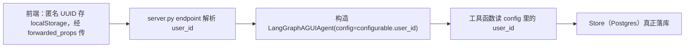

# Cognia User Knowledge Model 持久化 + 认知图谱个人页 —— 方案

> 状态：待 PM 确认
> 范围：后端先行（本次动手），前端仅出设计契约（本次不动手）

## 0. 结论先行

现状：**「用户懂什么」完全没有被记录**。`store=None` 写死、`user_id="local-user"` 写死、前端无 `user_id` 生成。代码里的 `get_store()` / `get_user_id()` 是已实现但从未被调用的死代码。

本次只做一件事：**把 User Knowledge Model（熟练度 + 知识模型）真正持久化，让同一匿名用户跨会话读回「懂什么」**。前端只出契约，等方案确认后再派牛马 1 号。

## 1. 现状根因（已精确核实到行）

| # | 根因 | 证据 |
|---|---|---|
| 1 | `store=None` 写死，所有写用户信息的操作被短路 | [server.py](cognia/server.py) `build_agent()` 中 `store=None` |
| 2 | `user_id="local-user"` 写死，所有请求共用同一身份 | [server.py](cognia/server.py) `build_agent(checkpointer=None, user_id: str = "local-user")` |
| 3 | 前端只持久化 `threadId`，无 `user_id` | [page.tsx](frontend/app/page.tsx) 仅 `THREAD_ID_KEY = "cognia:threadId"` |

由此 [tools.py](cognia/tools.py) 里所有 `if store and user_id` 判断恒为假：
- `propose_diagnosis` → 诊断结果不落库，当场丢弃
- `build_learning_goal` → 知识模型每次重生成，不冻结
- `read_learner_state` → 永远返回 `unassessed`

## 2. 目标与范围

### 2.1 In（本次）

- 后端接通 `store`（Postgres），真正持久化 proficiency / knowledge_model
- 后端实现 `user_id` 逐请求注入（走 runtime context，宪法 §5）
- 后端补两个读接口，为前端个人页做准备（`list_*` 纯函数 + `/knowledge-map` 端点）
- 前端设计契约（**只设计，不动手**）

### 2.2 Out（本次）

- Personal Wiki（第三个资产，独立立项）
- 登录 / 注册 / 真实账号体系（MVP 明确排除）
- 前端版图页开发（等方案确认后派牛马 1 号）

## 3. 方案总览



## 4. 后端改动（接口契约，已核实）

### 4.1 接通 store —— `server.py`

`lifespan` 内与 `checkpointer` 并列接上 `get_store()`，挂 `app.state`，降级时显式告警：

```python
# lifespan 内
store = await memory.get_store()          # 新增：真正调用（不再是死代码）
app.state.store = store
print("[Cognia] 使用 Postgres 持久化长期认知状态")
# 降级分支：store = None；必须 print 告警「长期记忆未启用」，禁止静默丢弃
```

`build_agent` 增加 `store` 形参并透传，删除 `user_id` 默认参数：

```python
def build_agent(checkpointer=None, store=None):
    teacher = models.get_conversation_agent_model()
    tools = build_cognia_tools(store=store, teacher=teacher)  # 不再传 user_id
    ...
```

### 4.2 user_id 逐请求注入（宪法 §5 runtime context）

**选型 A（主方案，宪法合规）**：`user_id` 走 `config["configurable"]["user_id"]`，不塞 State、不进闭包。

已核实链路（`ag_ui_langgraph/agent.py` + `copilotkit/langgraph_agui_agent.py`）：
1. `RunAgentInput` 有 `forwarded_props` 字段（前端→后端自定义数据通道）。
2. `LangGraphAGUIAgent.__init__(..., config=...)` 接受 config；`run()` 内 `config = ensure_config(self.config.copy())` 并保留 `configurable`、覆盖 `thread_id`。
3. `get_stream_kwargs()` 把 `configurable` 透传进 `graph.astream_events(config=...)`。
4. **但 `clone()` 不接受参数**，无法靠 `_agent.clone(config=...)` 逐请求注入 —— 必须复用 `_agent.graph` 重建轻量包装对象。

endpoint 改为（每请求一个轻量包装，graph 复用）：

```python
def _extract_user_id(input_data: RunAgentInput) -> str:
    props = getattr(input_data, "forwarded_props", None) or {}
    uid = props.get("user_id")
    if not uid:
        # 前端尚未传 user_id 的过渡期：降级为固定值，行为等同现状，但显式告警
        print("[Cognia] 未收到 user_id，降级为 local-user")
        return "local-user"
    return str(uid)

@app.post("/")
async def cognia_agent_endpoint(input_data: RunAgentInput, request: Request):
    await _auto_title_thread(request, input_data)
    user_id = _extract_user_id(input_data)
    request_agent = LangGraphAGUIAgent(
        name=_agent.name,
        description=_agent.description,
        graph=_agent.graph,                       # 复用同一个 graph
        config={"configurable": {"user_id": user_id}},
    )
    ...
```

### 4.3 工具读 user_id —— `tools.py`

删除工厂的 `user_id` 闭包参数，三个用到身份的工具有 `RunnableConfig` 参数，从 config 读：

```python
from langchain_core.runnables import RunnableConfig
from cognia.memory import get_user_id

def build_cognia_tools(diagnoser=None, planner=None, teacher=None, store=None):
    # 删除 user_id 参数
    ...

    @tool
    def read_learner_state(point_id: str, config: RunnableConfig) -> str:
        user_id = get_user_id(config)
        ...

    @tool
    def build_learning_goal(goal: str, config: RunnableConfig) -> str:
        user_id = get_user_id(config)
        ...

    @tool
    def propose_diagnosis(..., config: RunnableConfig) -> str:
        user_id = get_user_id(config)
        ...
```

> `store` 仍走闭包注入（进程级单例，不随请求变）；只有 `user_id` 走 config（逐请求）。

### 4.4 个人页后端准备 —— `memory.py` + `server.py`

- `memory.py` 新增两个读接口（纯函数，无副作用，供个人页拉版图）：
  - `list_knowledge_models(store, user_id) -> list[dict]`
  - `list_current_proficiencies(store, user_id) -> dict[point_id, state]`
- `server.py` 新增 `GET /knowledge-map?user_id=...`，聚合返回版图 JSON。

> 本端点数据前提是 4.1/4.2 已跑通（store 有数据），否则版图为空壳。

## 5. 前端设计契约（本次只设计，不动手）

由牛马 1 号实现，PM 只出契约 + review（红线 [[memory:884pc2i7]]）。

1. 新增 `cognia:userId` 到 `localStorage`，首次 `crypto.randomUUID()`，与 `threadId` 并列持久化。
2. 通过 AG-UI `forwardedProps.user_id` 把匿名标识传给后端。
3. 新增「认知图谱」个人页：调 `GET /knowledge-map`，渲染 DAG 星图 + 认知状态
   （章程 §8 视觉规范 [[memory:ixtbdkys]]：未探索虚点 / 半懂缺口 / 误解偏色 / 掌握实心点亮）。

## 6. 落地顺序

1. 接通 store（4.1）—— 先用 `local-user` 验证单用户链路真实写入。
2. user_id config 注入（4.2 + 4.3）—— 先 spike 验证 `RunnableConfig` 注入生效，失败则退选型 B（闭包重建）。
3. 个人页后端准备（4.4）—— 读接口 + 端点。
4. 补测试 + 自测 + 提交（阶段验收）。
5. 前端派活（5）—— 等方案确认后另行立项。

## 7. 验收标准（AC）

- **AC1 真实落库**：同 `user_id` 诊断后，`proficiency` namespace 有对应 Delta；重启后 `read_learner_state` 能读回非 `unassessed`。
- **AC2 跨会话读回**：同 `user_id` + 同 goal，第二次会话 `build_learning_goal` 返回「复用」而非「构建」，`point_id` 稳定。
- **AC3 多用户隔离**：不同 `user_id` 的熟练度互不可见。
- **AC4 降级不静默**：Postgres 不可用 / user_id 缺失时，有显式告警日志，且不抛 500。
- **AC5 前端不动**：本次不产生任何 frontend 代码变更。

## 8. 风险与决策点

| 风险 | 缓解 |
|---|---|
| `@tool` + `RunnableConfig` 注入不生效（user_id 为 None） | 开发第一步做 spike；失败退选型 B |
| 同步 `store.put` 在 AsyncPostgresStore 上的线程模型 | `memory.py` 注释已说明 executor 线程桥接，测试覆盖 |
| 前端未传 user_id 时数据仍共用一个身份 | 过渡期降级 `local-user` + 显式告警，前端派活后消除 |
