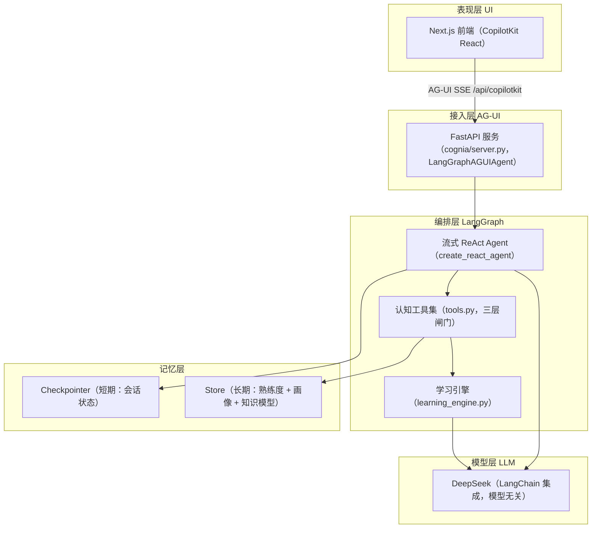
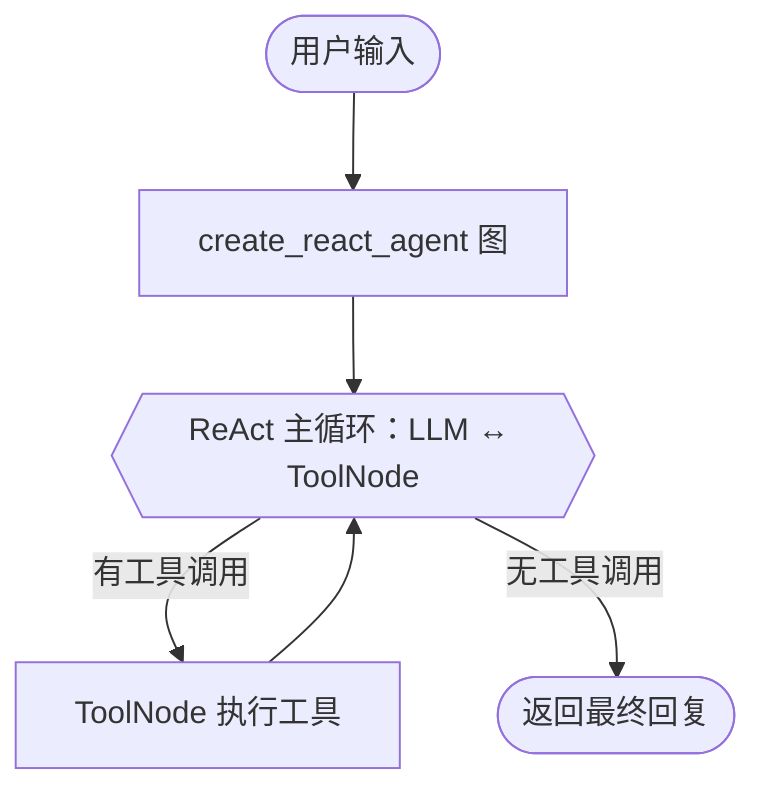

# Cognia 技术方案（Plan）

> 本文档是 Cognia 的「怎么做」方案，将 spec v2.0 与 clarifications 的业务决策翻译为可落地到代码的技术设计。
> 已确认的关键决策（见 §9）来自产品负责人对 Plan 草案的逐条拍板。

## 1. 核心架构判断：单 Agent 流式 ReAct + 工具内三层闸门

**Cognia 的探测、诊断、干预、回溯，本质是同一个「教学教练」的不同能力面，而非需要不同专长的独立角色。** 它们共享同一份知识模型、同一份认知状态、同一个聚焦知识点，拆成多 Agent 只会引入协调税与状态同步成本。

因此 MVP 架构 = **单个流式 ReAct Agent**（LangGraph 原生 `create_react_agent`，见 `server.py`），而非固定 6 节点的非流式流水线：

- 诊断的确定性靠**独立、更严格的 diagnoser prompt + 低 temperature** 锁死（`learning_engine.py`）。
- 认知裁决权**封装在工具 `propose_diagnosis` 内部**（诊断 → 双重验证 → 状态机三层闸门），Agent 只能「提议」，无直写长期状态的权限（宪法 §4 / state-machine §5）。
- 教学职责拆分靠**认知工具集**（`tools.py`）实现，工具签名只暴露 LLM 能填写的业务参数。

> 这与宪法 §3「能单干就不拆 agent」一致 [[memory:mgd696hp]]。多 Agent 化留待北极星验证通过、出现「需要明显不同专长」的真实需求后再评估。

## 2. 总体架构（四层）



数据流说明：Next.js 前端通过 CopilotKit Runtime（`/api/copilotkit`）以 AG-UI 协议（SSE）
连到 FastAPI 服务；`LangGraphAGUIAgent` 包装 `create_react_agent` 图，把流式事件映射为
AG-UI 的 `REASONING_*` / `TOOL_CALL_*` / `TEXT_MESSAGE_*` 事件，前端流式渲染思考链与工具卡片。

## 3. Agent 与工具设计

### 3.1 流式 ReAct 主循环（server.py）

核心闭环由 LangGraph 原生 `create_react_agent`（prebuilt）承载，不再手写 ReAct 循环。
`build_agent()` 在 `server.py` 中完成组装：`create_react_agent(model=teacher,
tools=tool_list, prompt=REACT_TEACHER_SYSTEM_PROMPT, checkpointer=...)`，框架内置
`ToolNode`、`bind_tools`、流式 `tool_call_chunks` 累积、工具执行、消息管理与
checkpoint 持久化。



- **流式**：`graph.astream(...)` 逐事件产出，由 `ag-ui-langgraph` 映射为 AG-UI 的
  `REASONING_*` / `TOOL_CALL_*` / `TEXT_MESSAGE_*` 事件，前端边生成边渲染思考链与工具卡片。
- **工具执行**：由框架 `ToolNode` 负责；工具内部可能调用同步 Store，与
  `AsyncPostgresStore` 的线程模型兼容（见 `memory.py` `get_store` 注释）。

### 3.2 认知工具集（tools.py，5 个工具）

| 工具 | 类型 | 职责 | 副作用 |
|------|------|------|--------|
| `read_learner_state(point_id)` | 读 | 读取当前用户对某知识点的五态认知状态 | 无 |
| `build_learning_goal(goal)` | 写 | load-or-build 构建/复用知识模型（`point_id` 跨会话稳定） | 首次构建冻结写 Store |
| `generate_probe(point_name, point_description)` | 教学 | 生成开放式探针问题，引导学生表达 | 无 |
| `propose_diagnosis(...)` | 写 | 提议诊断，内部强制三层闸门裁决是否迁移状态 | 迁移则增量写 Store |
| `explain(point_name, point_description, user_state)` | 教学 | 按认知状态讲解（partial 引导式 / misconception 颠覆式 / unknown 从零建立） | 无 |

工具由工厂 `build_cognia_tools(diagnoser, planner, teacher, store, user_id)` 构建：
依赖闭包注入，工具签名只暴露 LLM 能填写的简单参数；`user_id` 由工厂闭包注入，
**不暴露给 LLM**（宪法 §5：LLM 只能填业务参数，不能伪造身份）。

### 3.3 三层闸门：诊断 ≠ 迁移（安全边界核心）

`propose_diagnosis` 内部完整复用学习引擎的三层闸门，Agent 无法旁路：

1. **诊断**（`run_diagnosis`）：独立严格 diagnoser prompt 判定五态 + 置信度（高/中/低）+ 用户原话证据。
2. **双重验证**（`run_verification`）：仅当诊断候选为 `mastered` 时触发，要求「概念解释 + 场景辨析」两份独立正向证据全过。
3. **状态机裁决**（`resolve_migration`）：高置信度是唯一迁移门槛；中/低置信度一律不迁移；拓扑合法性由 `can_transition` 锁定。

任何 `proficiency[point_id] = diagnosis.state` 的直写都是旁路，属违规（state-machine §5 规则 1）。

### 3.4 会话与身份的持久化边界

- **`thread_id` 标识「一次会话」**：Checkpointer 只负责会话内消息历史的恢复。
- **`user_id` 标识「一个人」**：跨会话的长期认知状态靠 Store 按 `user_id` 隔离持久化，
  绝不依赖 Checkpointer（呼应 clarifications Q6）。
- 前端生成匿名 UUID → localStorage 持久化 → 作为 `threadId` / `user_id` 的来源，
  后续无缝升级真实身份体系时仅替换标识来源。

## 4. 数据模型（Pydantic Schema 形状）

```python
from datetime import datetime, timezone
from enum import Enum
from typing import Literal

from pydantic import BaseModel, Field

# 认知状态五态（spec v2.0）
class CognitiveState(str, Enum):
    UNASSESSED = "unassessed"        # 未评估
    MASTERED = "mastered"            # 已掌握
    PARTIAL = "partial"              # 部分掌握
    MISCONCEPTION = "misconception"  # 错误理解
    UNKNOWN = "unknown"              # 盲区

# 置信度三级（clarifications Q4：剔除硬编码百分比，只做行为分级）
class Confidence(str, Enum):
    HIGH = "high"
    MEDIUM = "medium"
    LOW = "low"

class KnowledgePoint(BaseModel):
    id: str
    name: str
    description: str
    prerequisites: list[str]  # 依赖的知识点 id

class KnowledgeModel(BaseModel):
    goal: str
    points: list[KnowledgePoint]

class Diagnosis(BaseModel):
    point_id: str
    state: CognitiveState
    confidence: Confidence
    evidence: list[str]  # 用户原话片段，严禁脑补（spec §6）

# 单项验证结果（区分「未评估」与「验证失败」，避免 bool 混淆）
class ValidationResult(str, Enum):
    UNASSESSED = "unassessed"  # 尚未验证
    PASSED = "passed"          # 验证通过
    FAILED = "failed"          # 验证失败

# 双重验证状态（mastered 判定需「概念解释 + 场景辨析」双过，见 state-machine.md）
class VerificationState(BaseModel):
    concept: ValidationResult                            # 概念解释验证结果
    scenario: ValidationResult                           # 场景 / 反例辨析验证结果
    concept_evidence: list[str]                          # 概念验证的证据（用户原话）
    scenario_evidence: list[str]                         # 场景验证的证据（用户原话）
    current_step: Literal["concept", "scenario", "done"]  # 当前验证到哪一步

class ProficiencyEntry(BaseModel):
    point_id: str
    from_state: CognitiveState | None  # 状态迁移起点（首次诊断时为 None）
    to_state: CognitiveState           # 状态迁移终点
    evidence: list[str]                # 支撑本次状态迁移的用户原话（非 AI 总结），支撑审计与认知变化分析
    timestamp: datetime = Field(default_factory=lambda: datetime.now(timezone.utc))
    update_type: Literal["delta"]      # 宪法 §5：增量 Delta，严禁全量重写

class Intervention(BaseModel):
    point_id: str
    intervention_type: Literal["probe", "explain", "correct", "backtrack"]
    content: str
```

## 5. 记忆层设计

| 记忆层 | 技术实现 | 存什么 | namespace |
|--------|---------|--------|-----------|
| 短期 | Checkpointer（Supabase Postgres） | 会话 state、消息历史 | 按 `thread_id` |
| 长期·熟练度 | Store（Supabase Postgres） | Proficiency JSON（增量 Delta） | `("proficiency", user_id)` |
| 长期·画像 | Store（Supabase Postgres） | 基础偏好（沟通风格/语言） | `("profile", user_id)` |
| 长期·知识模型 | Store（Supabase Postgres） | 冻结的知识模型（load-or-build） | `("knowledge_model", user_id)` |

**关键落地**：

- **认知 Profile 进化**（宪法 §5）：`("profile", user_id)` 存稳定偏好，`("proficiency", user_id)` 存动态熟练度，两类分开 namespace，均增量 Delta 更新。
- **知识模型持久化**（Task ⑨）：`("knowledge_model", user_id)` 以归一化 goal 为 key 冻结知识模型，保证 `point_id` 跨会话稳定（否则每会话重生成的 LLM 输出会导致按 `point_id` 读回历史熟练度查空）。
- **身份注入**（宪法 §5）：`user_id` 通过 runtime context 注入，不塞进 State。
- **匿名标识**（clarifications Q6）：前端生成 UUID → 客户端持久化 → 后端作为 `user_id` 隔离映射；后续无缝升级 Supabase Auth，仅替换标识来源。
- **证据链入 Proficiency**：每次状态迁移的 `ProficiencyEntry` 必须携带 `from_state → to_state + evidence + timestamp`，保证「为什么判成 partial」可追溯，支撑诊断准确率审计与认知变化分析。
- **生产工厂单例 + 共享连接池**：`get_checkpointer()` 返回 `AsyncPostgresSaver`（`server` 用 `astream`，同步 `PostgresSaver` 未实现 `aget_tuple` 会抛 `NotImplementedError`）；Checkpointer 与 Store 复用同一个 `AsyncConnectionPool`，避免多池竞争与连接数随会话数线性增长。
- **MVP 不引入 pgvector**：Proficiency 是结构化精确读取（`user_id + point_id → 状态`），无需语义向量检索；待需要「从历史学习记录语义召回相关认知证据」时再引入。

## 6. 接口与前端

- **前端**：Next.js（App Router）+ CopilotKit React（`@copilotkit/react-core/v2`），
  单一入口 `frontend/app/page.tsx`，渲染 `CopilotChat`。
- **后端**：FastAPI（`cognia/server.py`），用 `LangGraphAGUIAgent` 包装 `create_react_agent`
  图，通过 `add_langgraph_fastapi_endpoint` 暴露 AG-UI 协议端点（路径 `/`）。
- **协议**：AG-UI over SSE（`/api/copilotkit`）。前端 CopilotKit Runtime 转发到
  FastAPI 服务；思考链映射为 `REASONING_*` 事件，工具调用映射为 `TOOL_CALL_*` 事件，
  前端自动渲染思考过程与工具卡片。
- **会话持久化**：前端 `localStorage` 持久化 `threadId`，刷新后读回同一 `thread_id`，
  后端 Checkpointer 按 `thread_id` 恢复历史消息（避免 React remount 后重新 mint 新 UUID）。
- **对话管理**：CopilotKit 不内置会话列表，多会话切换 / 列表 / 删除需在
  Next.js 前端自行实现（`threadId` 集合 + Checkpointer 查询），属后续排期项。

## 7. 模型路由策略

| 角色 | 抽象模型名 | 绑定（默认） | 说明 |
|------|-----------|-------------|------|
| 知识模型构建 | `planner_model` | deepseek-v4-flash | 一次性调用，成本低 |
| 诊断 | `diagnoser_model` | deepseek-v4-pro（低 temperature） | 核心，独立严格 prompt，需强推理 |
| 干预/探测生成 | `teacher_model` | deepseek-v4-flash | 高频调用 |

> 全部走 LangChain 集成保持模型无关，未来可无痛切换 Claude 3.5 Sonnet / OpenAI / 本地模型。

## 8. 评估 harness

- **金标集**：选定标准知识域 **「Spring AOP」**，专家预先标注，**覆盖五态样本**（mastered / partial / misconception / unknown / unassessed），重点覆盖边界 `partial vs misconception`、`unknown vs unassessed`、`mastered vs partial` → 作为诊断 ground truth。
- **开发集 vs 盲测集分离**（宪法 §6）：开发调 prompt 用开发集；盲测集绝不写进任何 prompt 当 Few-shots，仅最终验收用。
- **打分脚本**：跑 `diagnose` → 对比专家标注 → 输出**多维度指标**：overall accuracy、各状态 accuracy、confusion matrix（重点盯 `unknown↔unassessed`、`partial↔misconception`、`mastered→partial`）→ 北极星「≥50% 专家命中」保留为及格线，但不作为唯一观察维度。

## 9. 已确认的关键决策

| # | 决策点 | 结论 |
|---|--------|------|
| 1 | 核心架构 | 单 Agent 流式 ReAct（`bind_tools` + `astream`）+ 工具内三层闸门 |
| 2 | 前端选型 | CopilotKit（AG-UI）+ Next.js |
| 3 | 接入层 | FastAPI + `LangGraphAGUIAgent`（AG-UI SSE） |
| 4 | 标准知识域 | Spring AOP |
| 5 | 数据模型与长期记忆 | 五态 + 置信度分级 + 三 namespace（proficiency / profile / knowledge_model）+ 匿名标识 |
| 6 | 模型路由 | 默认 deepseek-v4-flash / deepseek-v4-pro，LangChain 抽象留切换护栏 |
