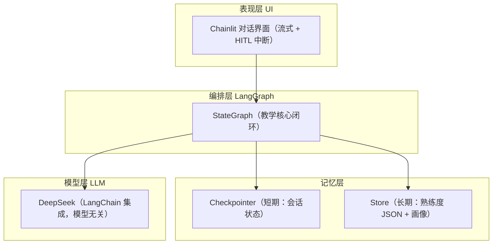
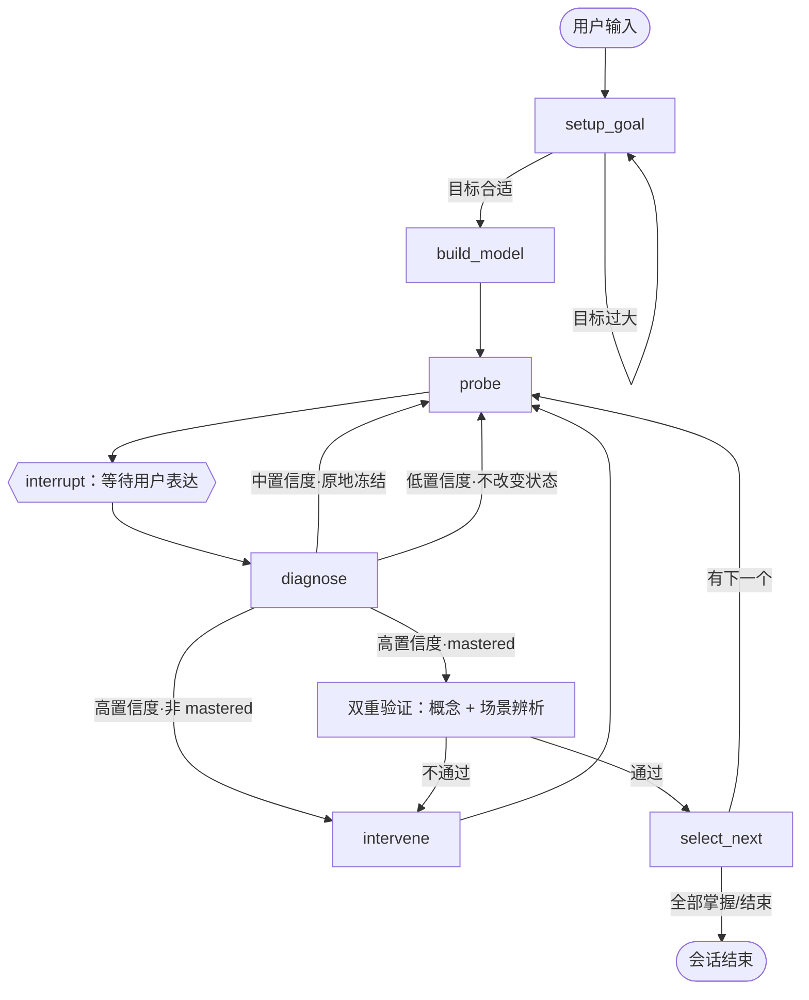

# Cognia 技术方案（Plan）

> 本文档是 Cognia 的「怎么做」方案，将 spec v2.0 与 clarifications 的业务决策翻译为可落地到代码的技术设计。
> 已确认的关键决策（见 §9）来自产品负责人对 Plan 草案的逐条拍板。

## 1. 核心架构判断：单 Agent + 单 Stateful Graph 多节点

**Cognia 的探测、诊断、干预、回溯，本质是同一个「教学教练」的不同能力面，而非需要不同专长的独立角色。** 它们共享同一份知识模型、同一份认知状态、同一个聚焦知识点，拆成多 Agent 只会引入协调税与状态同步成本。

因此 MVP 架构 = **单个 LangGraph `StateGraph`，用「多个节点」表达不同职责，而非「多个 Agent」**。

- 诊断的确定性靠**独立、更严格的 prompt + 更低的 temperature** 锁死，而非派独立 Agent。
- 循环控制靠**纯逻辑节点**（`select_next`，非 LLM）完成。
- 教学职责拆分靠**状态机节点**实现。

> 这与宪法 §3「能单干就不拆 agent」一致 [[memory:mgd696hp]]。多 Agent 化留待北极星验证通过、出现「需要明显不同专长」的真实需求后再评估。

## 2. 总体架构（四层）



## 3. LangGraph 状态机设计

### 3.1 核心闭环 → 节点映射

spec 核心闭环「探测 → 表达 → 诊断 → 干预 → 再表达 → 再诊断」映射为 6 个节点：

| 节点 | 职责 | 对应闭环步骤 | 是否 LLM 调用 |
|------|------|-------------|--------------|
| `setup_goal` | 接收目标，过大则引导缩小 | 前置 | ✅ 是 |
| `build_model` | 生成知识模型（5~15 知识点 + 依赖） | 前置 | ✅ 是 |
| `probe` | 生成探针问题（AI 主动出击） | 探测 | ✅ 是 |
| `diagnose` | 基于表达判断五态 + 置信度 + 证据 | 诊断 | ✅ 是 |
| `intervene` | 生成干预动作（追问/解释/纠错/回溯） | 干预 | ✅ 是 |
| `select_next` | 掌握后选下一个知识点，或结束 | 循环控制 | ⚪ 否（纯逻辑） |

### 3.2 状态机图



### 3.3 两个 LangGraph 关键机制

1. **`interrupt()` 处理「等待用户表达」**：`probe` 生成问题后，用 `interrupt({"question": ...})` 暂停图，把问题交给用户；用户回答后 resume，答案作为 state 喂给 `diagnose`。这是 Cognia「AI 主动提问 → 用户回答」节奏的原生支撑，也是 HITL 的正确用法。

2. **`checkpointer` + `thread_id` 持久化会话**：整个学习会话是长生命周期 thread，每轮对话 resume 同一个 thread，state 自动恢复。**职责边界**：`thread_id` 仅标识「一次会话」，Checkpointer 只负责会话内的状态恢复；跨会话的长期认知状态（Proficiency JSON）必须靠 Store 按 `user_id` 持久化，不能依赖 Checkpointer（呼应 clarifications Q6）。

### 3.4 循环防失控

State 内置两个计数器（呼应 spec §6 硬约束）：

- `intervention_fail_count`：单知识点干预失败计数，≥3 触发回溯或挂起（spec「干预循环硬性约束」）。
- `loop_count` + `recursion_limit`：总循环上限，兜底防烧钱。

### 3.5 双重验证状态（mastered 判定的状态化）

mastered 判定必须「概念解释 + 场景辨析」双过（spec US-5），且该验证过程必须被 State 显式记录，而非无状态摆设：

- State 持有 `verification: VerificationState` 字段，记录两类验证分别是否通过、各自证据、以及当前进行到哪一步。
- `diagnose` 节点只产出「诊断结果」（五态 + 置信度 + 证据）；它可判断「当前表现看起来达到 mastered」，但不能直接完成状态迁移。
- 「验证是否闭环」由纯逻辑节点判断：`concept == PASSED && scenario == PASSED` 才允许状态迁移到 mastered（见 state-machine.md）。
- **`mastered` 是「最终状态迁移的结果」，不是单次 `diagnose` 的直接产物**：任何进入 mastered 的迁移都必须完成概念解释 + 场景辨析双重验证，避免出现 `diagnosis.state == MASTERED` 直接写长期状态的旁路。

## 4. 数据模型（Pydantic Schema 形状）

```python
from datetime import datetime, timezone
from enum import Enum
from typing import Literal

from pydantic import BaseModel, Field

# 认知状态五态（spec v2.0）
class CognitiveState(str, Enum):
    UNASSESSED = "unassessed"        # 未评估
    MASTERED = "mastered"            # 已掌握
    PARTIAL = "partial"              # 部分掌握
    MISCONCEPTION = "misconception"  # 错误理解
    UNKNOWN = "unknown"              # 盲区

# 置信度三级（clarifications Q4：剔除硬编码百分比，只做行为分级）
class Confidence(str, Enum):
    HIGH = "high"
    MEDIUM = "medium"
    LOW = "low"

class KnowledgePoint(BaseModel):
    id: str
    name: str
    description: str
    prerequisites: list[str]  # 依赖的知识点 id

class KnowledgeModel(BaseModel):
    goal: str
    points: list[KnowledgePoint]

class Diagnosis(BaseModel):
    point_id: str
    state: CognitiveState
    confidence: Confidence
    evidence: list[str]  # 用户原话片段，严禁脑补（spec §6）

# 单项验证结果（区分「未评估」与「验证失败」，避免 bool 混淆）
class ValidationResult(str, Enum):
    UNASSESSED = "unassessed"  # 尚未验证
    PASSED = "passed"          # 验证通过
    FAILED = "failed"          # 验证失败

# 双重验证状态（plan §3.5：mastered 判定需「概念解释 + 场景辨析」双过）
class VerificationState(BaseModel):
    concept: ValidationResult                            # 概念解释验证结果
    scenario: ValidationResult                           # 场景 / 反例辨析验证结果
    concept_evidence: list[str]                          # 概念验证的证据（用户原话）
    scenario_evidence: list[str]                         # 场景验证的证据（用户原话）
    current_step: Literal["concept", "scenario", "done"]  # 当前验证到哪一步

class ProficiencyEntry(BaseModel):
    point_id: str
    from_state: CognitiveState | None  # 状态迁移起点（首次诊断时为 None）
    to_state: CognitiveState           # 状态迁移终点
    evidence: list[str]                # 支撑本次状态迁移的用户原话（非 AI 总结），支撑审计与认知变化分析
    timestamp: datetime = Field(default_factory=lambda: datetime.now(timezone.utc))
    update_type: Literal["delta"]      # 宪法 §5：增量 Delta，严禁全量重写

class Intervention(BaseModel):
    point_id: str
    intervention_type: Literal["probe", "explain", "correct", "backtrack"]
    content: str
```

## 5. 记忆层设计

| 记忆层 | 技术实现 | 存什么 | namespace |
|--------|---------|--------|-----------|
| 短期 | Checkpointer（Supabase Postgres） | 会话 state、消息历史 | 按 `thread_id` |
| 长期·熟练度 | Store（Supabase Postgres） | Proficiency JSON | `("proficiency", user_id)` |
| 长期·画像 | Store（Supabase Postgres） | 基础偏好（沟通风格/语言） | `("profile", user_id)` |

**关键落地**：

- **认知 Profile 进化**（宪法 §5）：`("profile", user_id)` 存稳定偏好，`("proficiency", user_id)` 存动态熟练度，两类分开 namespace，均增量 Delta 更新。
- **身份注入**（宪法 §5）：`user_id` 通过 runtime context 注入，不塞进 State。
- **匿名标识**（clarifications Q6）：前端生成 UUID → 客户端持久化 → 后端作为 `user_id` 隔离映射；后续无缝升级 Supabase Auth，仅替换标识来源。
- **证据链入 Proficiency**：每次状态迁移的 `ProficiencyEntry` 必须携带 `from_state → to_state + evidence + timestamp`，保证「为什么判成 partial」可追溯，支撑诊断准确率审计与认知变化分析。
- **MVP 不引入 pgvector**：Proficiency 是结构化精确读取（`user_id + point_id → 状态`），无需语义向量检索；待需要「从历史学习记录语义召回相关认知证据」时再引入。

## 6. 接口与前端

- **UI 选型**：Chainlit。原生支持流式对话 + HITL 中断控制（interrupt），不做 Streamlit。
- **MVP 暂不引入 FastAPI**：Chainlit 直接驱动 LangGraph 运行，砍掉 API 转发层。北极星验证通过后再重构为「FastAPI API 层 + Chainlit 调 API」。

## 7. 模型路由策略

| 角色 | 抽象模型名 | 绑定（默认） | 说明 |
|------|-----------|-------------|------|
| 知识模型构建 | `planner_model` | deepseek-v4-flash | 一次性调用，成本低 |
| 诊断 | `diagnoser_model` | deepseek-v4-pro（低 temperature） | 核心，独立严格 prompt，需强推理 |
| 干预/探测生成 | `teacher_model` | deepseek-v4-flash | 高频调用 |

> 全部走 LangChain 集成保持模型无关，未来可无痛切换 Claude 3.5 Sonnet / OpenAI / 本地模型。

## 8. 评估 harness

- **金标集**：选定标准知识域 **「Spring AOP」**，专家预先标注，**覆盖五态样本**（mastered / partial / misconception / unknown / unassessed），重点覆盖边界 `partial vs misconception`、`unknown vs unassessed`、`mastered vs partial` → 作为诊断 ground truth。
- **开发集 vs 盲测集分离**（宪法 §6）：开发调 prompt 用开发集；盲测集绝不写进任何 prompt 当 Few-shots，仅最终验收用。
- **打分脚本**：跑 `diagnose` → 对比专家标注 → 输出**多维度指标**：overall accuracy、各状态 accuracy、confusion matrix（重点盯 `unknown↔unassessed`、`partial↔misconception`、`mastered→partial`）→ 北极星「≥50% 专家命中」保留为及格线，但不作为唯一观察维度。

## 9. 已确认的关键决策

| # | 决策点 | 结论 |
|---|--------|------|
| 1 | 核心架构 | 单 Agent + 单 Stateful Graph 多节点 |
| 2 | 前端选型 | Chainlit |
| 3 | FastAPI 时机 | 方案 A：MVP 暂不引入，Chainlit 直接驱动 |
| 4 | 标准知识域 | Spring AOP |
| 5 | 数据模型与长期记忆 | 完全认可（五态 + 置信度分级 + 双 namespace + 匿名标识） |
| 6 | 模型路由 | 默认 deepseek-v4-flash / deepseek-v4-pro，LangChain 抽象留切换护栏 |
