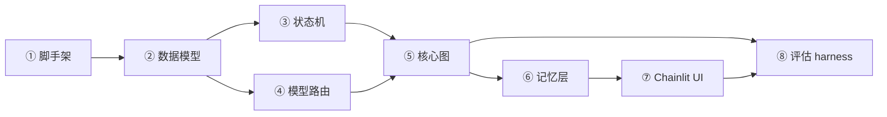

# Cognia 任务拆解（Tasks）

> 将 Plan 翻译为原子化、可独立验证、按依赖排序的任务清单。
> 执行纪律：每个任务一次 agent 调用完成、不丢上下文；完成即停下验收，绝不一次性生成整个项目。

## 执行约定（不可谈判）

- 包管理工具：**uv**
- 冲突裁决：Plan 与 state-machine.md 冲突时，**以 state-machine.md 的业务规则为准**；若业务规则本身无法落地，**不自行修改，先指出冲突**
- 标准知识域：**Spring AOP**（已从 Plan §8 的「Python 装饰器」修订而来）
- 模型 ID：`deepseek-chat` 已于 2026-07-24 退役，改用 `deepseek-v4-flash` / `deepseek-v4-pro`（任务④最终确认）

## 任务总览

## 任务明细

### 任务① 工程脚手架

- **做什么**：搭建目录结构 + 依赖管理（uv）+ 环境变量模板。
  - 目录：`cognia/`（主包）、`tests/`、`scripts/`、`data/`（金标集）
  - `pyproject.toml`（uv 管理）
  - `.env.example`：`DEEPSEEK_API_KEY`、`DATABASE_URL`、`LANGFUSE_*`、模型 ID
  - `.gitignore`
- **依赖清单**（已查证官方最新稳定版）：`langgraph>=1.2.0`、`langgraph-checkpoint-postgres>=3.1.0`、`langgraph-checkpoint-sqlite>=3.1.0`、`langchain-core>=1.3.0`、`langchain-deepseek>=1.1.0`、`pydantic>=2.7.4`、`chainlit`、`python-dotenv`
- **验收标准**：`uv sync` 成功；`.env.example` 字段齐全；`.gitignore` 已排除 `.env`、`.venv`、`__pycache__`。
- **依赖**：无

### 任务② 数据模型层（Pydantic Schema）

- **做什么**：以当前已确认的 state-machine.md + plan.md 为准实现数据模型 `cognia/schemas.py`，不机械复制旧版 Schema。
  - `CognitiveState`（五态）、`Confidence`（三级）、`ValidationResult`（三态）
  - `KnowledgePoint`、`KnowledgeModel`、`Diagnosis`、`VerificationState`、`ProficiencyEntry`、`Intervention`
- **验收标准**：所有模型可导入；`ProficiencyEntry` 的 `from_state → to_state`、`evidence`、`update_type="delta"` 字段齐全；可 JSON 序列化/反序列化；带单元测试。
- **依赖**：①

### 任务③ 状态机层（五态转移矩阵）

- **做什么**：把 state-machine.md 落地成纯函数 `cognia/state_machine.py`：
  - `can_transition(from_state, to_state) -> bool`（硬编码转移矩阵表）
  - `is_mastered_migration_allowed(verification) -> bool`（要求 `concept==PASSED && scenario==PASSED`）
- **验收标准**：单元测试穷举 5×5=25 种组合，与 state-machine.md 总览表逐一比对；锁死 `unknown→misconception` 等禁止项。
- **依赖**：②

### 任务④ 模型路由层（LangChain 抽象 + DeepSeek）

- **做什么**：`cognia/models.py`，用 LangChain 抽象封装三个角色，绑定 DeepSeek：
  - `planner_model` / `teacher_model`：`deepseek-v4-flash`
  - `diagnoser_model`：`deepseek-v4-pro` + 低 temperature + 独立严格 prompt（结构化输出）
  - 统一走配置，可换 Claude / OpenAI / 本地模型（宪法 §7）
- **验收标准**：三个模型能初始化；`diagnoser_model` 能返回结构化诊断（绑定 `Diagnosis` schema）；mock 输入跑通一次。
- **依赖**：②

### 任务⑤ LangGraph 核心图（6 节点 + interrupt + 防失控）

- **做什么**：`cognia/graph.py`，实现 plan §3 的完整 StateGraph：
  - State（TypedDict）：消息、`knowledge_model`、`current_point_id`、`diagnosis`、`verification`、`intervention_fail_count`、`loop_count`
  - 6 节点：`setup_goal`、`build_model`、`probe`、`diagnose`、`intervene`、`select_next`
  - 条件边严格按 state-machine 转移矩阵 + 置信度分级路由
  - `interrupt()` 在 `probe` 后暂停等待用户表达
  - 防失控：`intervention_fail_count ≥ 3` 回溯/挂起 + `recursion_limit`
  - **干预失败定义**：一次失败 = 完成「干预 → 探测 → 用户表达 → 诊断」完整闭环后，当前知识点状态**未改善**（仍 misconception / partial 无提升 / 或降级）。用户说「我不懂」只是情绪表达，不经诊断不计数。
- **验收标准**：
  - 用假 LLM（mock）跑通「设目标 → 建模型 → 探测 → 诊断 → 干预 → 掌握 → 结束」最小闭环
  - 中/低置信度路径、3 轮失败回溯路径均有测试覆盖
  - **诊断 ≠ 迁移测试**：必须证明中/低置信度诊断不会修改长期认知状态；只有满足状态机迁移条件的高置信度诊断才能产生 Proficiency Delta（对应 state-machine §5 通用规则 1）
- **依赖**：② ③ ④

### 任务⑥ 记忆层（Supabase Checkpointer + Store）

- **做什么**：`cognia/memory.py`：
  - Checkpointer 接 Postgres（按 `thread_id` 恢复会话）
  - Store 接 Postgres（`("proficiency", user_id)` 存熟练度、`("profile", user_id)` 存画像）
  - 匿名 `user_id` 通过 runtime context 注入，不塞 State
  - 熟练度增量 Delta 写入（append，不覆盖）
- **验收标准**：同一 `user_id` 跨会话能读到历史熟练度；不同 `user_id` 数据隔离；写库走 Delta 追加。
- **依赖**：① ⑤

### 任务⑦ Chainlit UI（流式 + HITL）

- **做什么**：`cognia/app.py`（Chainlit）：
  - 流式对话，对接 LangGraph 图
  - HITL：`interrupt` 抛出的问题渲染给用户，用户回答后 resume
  - 前端生成匿名 UUID → 客户端持久化 → 传后端作为 `user_id`
- **验收标准**：浏览器里能体验「AI 主动提问 → 我回答 → AI 诊断 → 主动干预」的真实流式对话体感（宪法 §2）。
- **依赖**：⑤ ⑥

### 任务⑧ 评估 harness（Spring AOP 金标集 + 打分脚本）

- **做什么**：`scripts/eval.py` + `data/`：
  - 金标集：**Spring AOP**，覆盖五态样本（mastered / partial / misconception / unknown / unassessed），重点覆盖边界（partial vs misconception、unknown vs unassessed、mastered vs partial）；每个样本需明确「正确状态 / 用户典型回答 / 为什么属于该状态 / 判定依据（关键证据）」
  - 开发集 vs 盲测集分离（宪法 §6：盲测集绝不进 prompt 当 Few-shots）
  - 打分脚本：跑 `diagnose` → 对比专家标注 → 输出多维指标：overall accuracy、各状态 accuracy、confusion matrix（重点盯 unknown↔unassessed、partial↔misconception、mastered→partial）→ 北极星「≥50%」保留为及格线，不作唯一观察维度
- **验收标准**：脚本能跑出多维指标（整体 + 分状态 + 混淆矩阵）；盲测集与开发集物理隔离。
- **依赖**：⑤ ⑦
- **⚠️ 金标集由 AI 先出草稿、产品负责人审核修正**（非 agent 独立完成项）。
